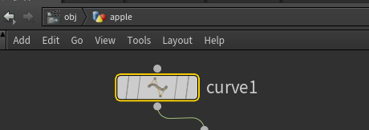
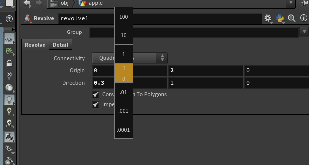
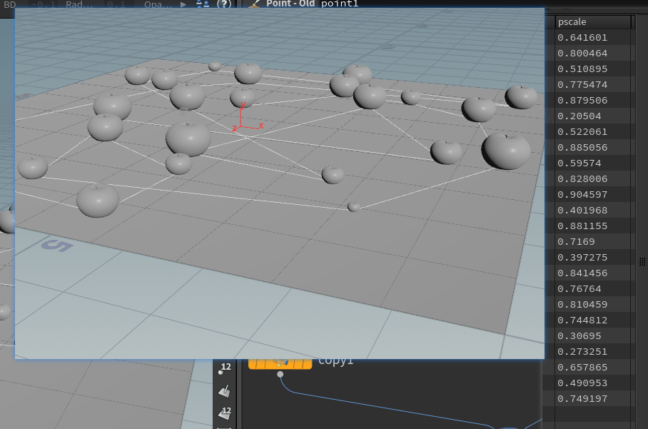

## 第一课 
主要是原理   

#### 学习 
[网站](https://www.bilibili.com/video/av31582609?from=search&seid=10333679531233289376) 

#### side   
出昂及一个苹果模型 熟悉节点状态    
      
1.  在节点 又几个面板可以可以选择， 创建模型选择使用 obj面板    
   
其他先不用管   
2. 创建节点可以通过 tab 弹出框，然后通过 写入命令知道，  但是测试安下空格也可以    
     
 或者是按下空格    
    
出来很多    

3. 说明创建节点顺序说明   
 +  首先是在在外建立一个  几何体节点，，，  
 +  然后后续所有的资源都在里面建立，里面会用到很多节点 
 + 双击节点先建立一个 曲线节点， 具体制作是利用 类似于loft 放样的处理方法   
    
 + 说明一下 视图切换， 快捷是 空格+ 123 4    
       
 + 需要给先换横截面 切换到空格+3 视图     
       
       
   创建过程 需要选择 节点，视图切换到编辑状态 画线      
       

 + 下来就是选择， 这里链接成 revolve 节点   选择 nures 方式最后转换车 poly  
 + 加入 一个 convert 节点 
       
  最后集合体里面包括 制作方式   

#### 视图说明  
  
+ 显示点    
+ 显示点法线    
+ 显示拖尾 向量方向 
+ 显示点序号    
+ 显示面法线    
+ 显示面序号    
+ 

#### 缝合节点 
+ fuse 
   
+ 缝合前后关系  
  
   +    
+ 
### 参数调剂  
+    
+ 参数调剂是按下中键盘   
+ 

#### 一个节点可以创建多个子模型概念   
   

#### 合并节点  
   
+ 创建的模型部分合并起来  
   
+ 因该是需要调整   

#### 变换节点   
  

+ 这里 加入变换 只能调剂参数    选择变换节点以后， 然后在 视图按下  enter  
+  注意是    是 enter   
+ 会加入一个编辑节点可以交换编辑   
   
    
+ 同时注意到  这里 点击这个  上面是选择整合 节点， 现在是选择元素   

#### 旋转节点 twist    
  
+ 我测试怎么都不行， 原理是我的苹果建立太大了， 没有注意单位   给了很高数值才有变换     
+    
 
#### 创建一个平面节点    
  
+ 单独创建一个平面的 只能看到他的删格显示， 需要 链接到 mege 节点 就可以看到      
     
    

#### 对地面加入 变换节点   
+ 测试加入一个节点可以编辑的   
+ 一般编辑 都是 选择节点 然后 选择enter  操作完成 会视图查看  视图经常会锁主， 一般 按下  spec 就可以  空格    

#### 在Geomety 级别也是可以创建一些Grid 会自动 有面显示   
   

#### 当编辑其实一个物体时候  不想影响到其他  可以使用下面操作   
   

##### 出了问题通过节点信息可以推理出问题在哪里    
    

#### 关于拷贝有些问题   
     
关于拷贝节点，一般一边是传入节点 一边是需要复制的位置  可以传入点， 创建一个面片 加入了一些点， 节点会自动找到，   老师说使用Add 可以计入点， 我测试目前有问题  
是的，没有找到原因。 

#### 是 scatter 实现撒点功能    
   
这个节点可以在模型上 和体积内进行撒点，实现随机复制操作      

  
测试可以在任何模型上实现处理  

#### 需要说明下次制作还是 先处理单位 不然 制作中各种参数都可能会不对    

****
#### 还可以在线上实现处理  

#### alt +1 快速切换 视图 和节点   切换视图  然后通过  空格 + 1 2 3 4 等来切换视图 的不同角度  

#### 默认创建的点没有法显2， 所以苹果会倒地， 处理的方法是 --- 可以加入一个 point 点来完成操作，  解决问题
   
+ 可以看到线的排布操作  
+ 

#### point在新版 中， 新版本中叫 point—old 
   
+ 加入之后会有很多可以更改， 比如 点的色 a 通道 发现等  纹理 
+ 由于线是没有法线的， 所以这里点击 add NOrmal  
+ 加入之后 默认是一个表达式， @N.x  就是原来是多少， 现在就是多少  
+ 这里需要 自定义法线， 
  
+ 删除通道  
+ 自定义数值   
  
+  删除通道以后 数据就可以自定填写， 通道的颜色 由 绿色变成了黑色，  法线数据给了 向上
+  视图中开启法线 可以看到 法线信息  

#### 通过调整    
   

#### 拷贝原理  
    
+ 是z轴对应 z轴的关系   

#### 节点的所有信息    
   
+ 节点的所有信息都在  之前叫细节显示 现在是 集合数据摄影表  
+ 比如我我们给点加入 一些信息 在这里都可以看到  
+ 我们选择任何数据信息 这里都是可以看到的   

#### 在针对循环 批量复制是可以写一些表达式的，   
   
+  这里面是使用的就是 rand 随机函数 然后通过 $  后面可以根据提示加一些固定的相  
+  这里使用的是PT 就是上一次的 位置序号  

#### 赋值后的效果  
   

####  拷贝节点说明   
    
+ 正常我们的苹果是 从 curve 上哪到点信息， 但是复制后苹果歪了 是应为点没有法线信息， 
+ 通过加一个point 来处理  里面包括顶点色 位置 法线 纹理坐标 地形 向量 随机等    

#### 还有一种是就是在 copy节点自定义属性， 然后通过 随机后给对面的 t'ranform 来使用 
#### 设计到表达式   
  
+ 选择copy 节点 在 stamp 中 开启， 在下面偶 50 个属性可以使用， 这里是建立一个变量， 然后通过 表达式还是获取上线线的 点的序号   ，rand  由于是旋转 ，所以这里进行了随机度的处理  
+ 到对面的写法 
    
  获取变量方式是 stamp  第一个是下个对路径 第二就是 copy中变量  第三个是一个默认数值   
#### 叫苹果落到平面上， 通过它的包围和最大最小识别    
   
+  上面是图片展示 
+  通过 新建立一个 变换节点 来对上一个节点获取   
**bbox** 接口是获取包围盒子， 第一个是获取谁的包围盒子 后面的是 获取包围盒的神数值  
这里是 y 变成 包围盒子-数， 

#### 苹果随机   
   
+ 我给一个苹果加入 twist 节点调整blend  taper  然后 给copy 添加新的节点， 这里数值是同过给一个 苹果进行的测试   blend 会 -15 15     taper 是 0.6 0.8 

#### 山脉的节点  mountian  
   
+ 调节参数可以给苹果加入 不规则的形状  
+ 

#### 标签整理  

+ 第一个是可以功能性整理节点， 选择节点点击 按钮 可以创建一个 模块 
+ 可以独立加入一个标签 
+ 可以加入背景参考图片等操作 ， 里哟个 ctrl + i 实现编辑在 ctrl+i 回复  

#### 创建  
   
 + 可以把创建的苹果步骤 做成一个独立的 包， 这样级可以重复使用，可以理解长函数等东东 

##### 可以保持uv界面配置   
  
