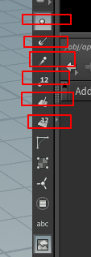

## 第一课 
主要是原理   

#### 学习 
[网站](https://www.bilibili.com/video/av31582609?from=search&seid=10333679531233289376) 

#### side   
出昂及一个苹果模型 熟悉节点状态    
      
1.  在节点 又几个面板可以可以选择， 创建模型选择使用 obj面板    
   
其他先不用管   
2. 创建节点可以通过 tab 弹出框，然后通过 写入命令知道，  但是测试安下空格也可以    
     
 或者是按下空格    
    
出来很多    

3. 说明创建节点顺序说明   
 +  首先是在在外建立一个  几何体节点，，，  
 +  然后后续所有的资源都在里面建立，里面会用到很多节点 
 + 双击节点先建立一个 曲线节点， 具体制作是利用 类似于loft 放样的处理方法   
    
 + 说明一下 视图切换， 快捷是 空格+ 123 4    
       
 + 需要给先换横截面 切换到空格+3 视图     
       
       
   创建过程 需要选择 节点，视图切换到编辑状态 画线      
       

 + 下来就是选择， 这里链接成 revolve 节点   选择 nures 方式最后转换车 poly  
 + 加入 一个 convert 节点 
       
  最后集合体里面包括 制作方式   

#### 视图说明  
  
+ 显示点    
+ 显示点法线    
+ 显示拖尾 向量方向 
+ 显示点序号    
+ 显示面法线    
+ 显示面序号    
+ 

#### 缝合节点 
+ fuse 
   
+ 缝合前后关系  
  
   +    
+ 
### 参数调剂  
+    
+ 参数调剂是按下中键盘   
+ 

#### 一个节点可以创建多个子模型概念   
   

#### 合并节点  
   
+ 创建的模型部分合并起来  
   
+ 因该是需要调整   

#### 变换节点   
  

+ 这里 加入变换 只能调剂参数    选择变换节点以后， 然后在 视图按下  enter  
+  注意是    是 enter   
+ 会加入一个编辑节点可以交换编辑   
   
    
+ 同时注意到  这里 点击这个  上面是选择整合 节点， 现在是选择元素   

#### 旋转节点 twist    
  
+ 我测试怎么都不行， 原理是我的苹果建立太大了， 没有注意单位   给了很高数值才有变换     
+    
 
#### 创建一个平面节点    
  
+ 单独创建一个平面的 只能看到他的删格显示， 需要 链接到 mege 节点 就可以看到      
     
    

#### 对地面加入 变换节点   
+ 测试加入一个节点可以编辑的   
+ 一般编辑 都是 选择节点 然后 选择enter  操作完成 会视图查看  视图经常会锁主， 一般 按下  spec 就可以  空格    

#### 在Geomety 级别也是可以创建一些Grid 会自动 有面显示   
   

#### 当编辑其实一个物体时候  不想影响到其他  可以使用下面操作   
   

##### 出了问题通过节点信息可以推理出问题在哪里    
    

#### 关于拷贝有些问题   
     
关于拷贝节点，一般一边是数 是