## 第二大课 

#### 渲染器
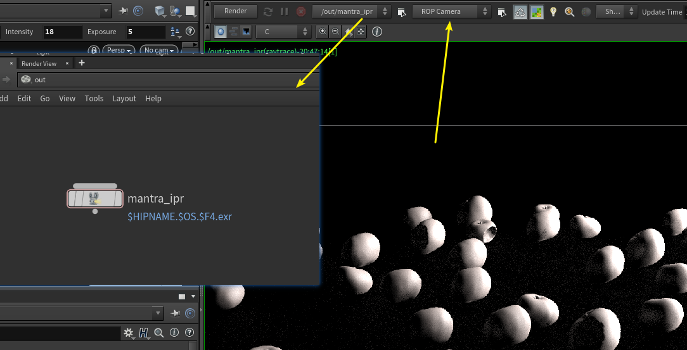  
+ 自动创建宣热其  

#### 默认渲染同时提供了一个渲染节点   
+ 在out 中查找  
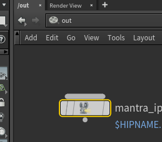    
+ 一些属性说   ：
 
+ 选择节点在属性中查找    
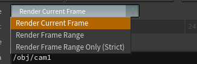 
+ 设置相机   
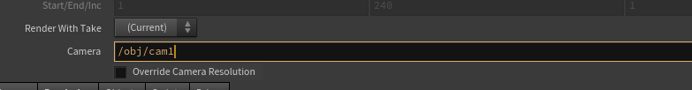  
+ 设置渲染路径默认是渲染到当前houdini的目录中 reader 文件中 
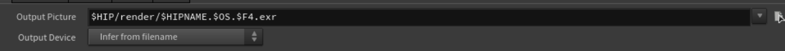   

+ 在rendring 中可以设置要处理的渲染器   
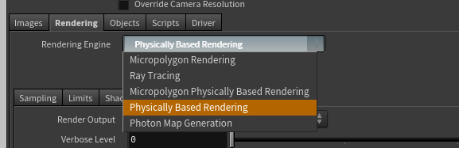 

+ 默认17 周边的属性都没有了， 需要右键开启来  
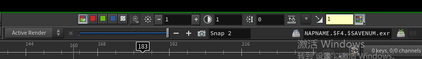  
  这里说明的是 snap 旁边的相机可以记录， 方便对比  

#### hdr贴图指定问问题
+ 选择创建的灯光    
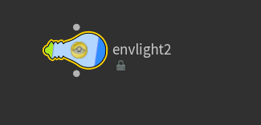  
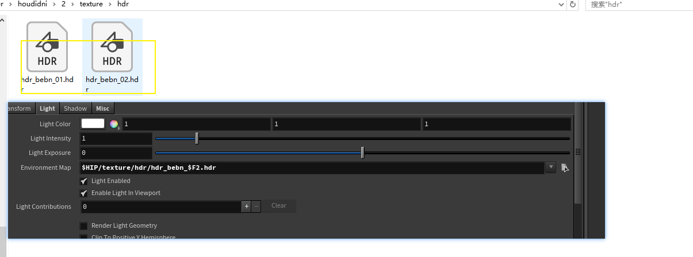  
+ 比较奇怪， 这里hdr不能序列模式， 不然会档子序列 表达式方式加入   

+ 解决方法是    
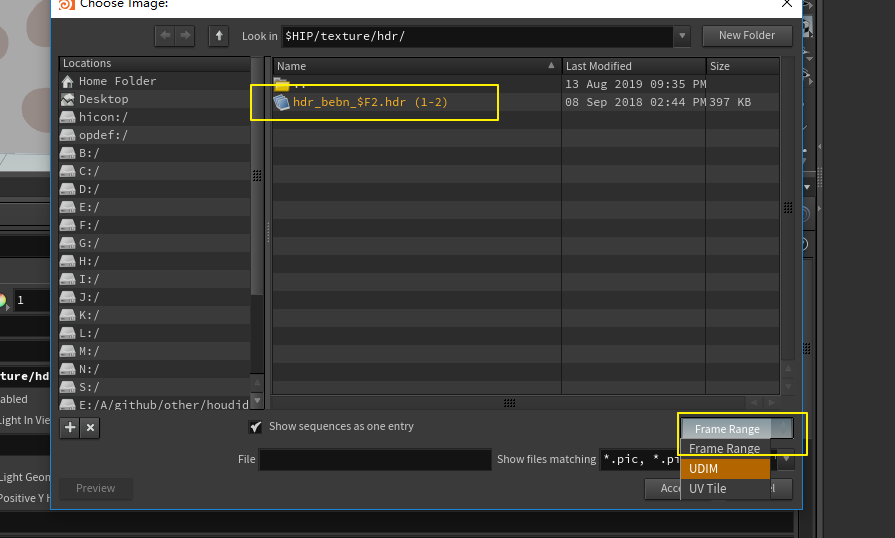  
+ 这里有一个 帧rande 设置， 设置成下面两种 就可以了，  不要是帧rander 方式    

+ 看到 hdr图  
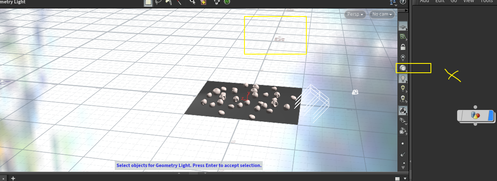    
+ 不能是上图 设置方式，不然看不到我指定的hdr图     

+ 选择hdr图的方向处理     
+ 

