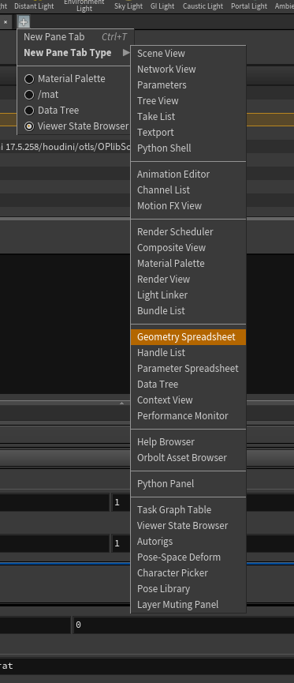

### 这个系列是 houdini零基础入门  另外的处理    
#### 从基础操作学习起    

#### 使用什么样的脚本 是python 还是 hsicrit  
     

####每个属性面板都有 选择是脚本还是 hsicipt    
  

#### 模块说明   
  
+ img 合成使用  
+ ch 角色 
+ obj 大多数  
+ out 渲染暑促 
+ mat shop 说是 材质 
+ DOP 是动力学模块  火 水 粒子 都是在这里模拟   
+ 

sop = 现在 obj 

#### 可以支持拖拽   
   

#### 背景设置    
   
 + 可以设置背景是灰还是黑， 可以设置图片是否mip 可以设置显示最大纹理 
 +  快捷键是 D  

#### Houdini单位设置  
   
+ 如果一个box是一米的化， 以盒子是5个格子就是0.25米 

#### 显示贴图   
   
    
+ 显示小的坐标   
 
+ 显示属性， 右键有处理，子啊 快捷键 D 中 visualize中以后设置   
   

+ 选择面片在视图回车 第一次是显示的是这种情况， 砂锅面显示是的 属性， 需要安下 alt 右键 切换，点击小图标可以到层级中去      
     

+ 课编辑 选择
  

+ 初步发现编辑的点， 选择元素 然后按下 esc 下面的  波浪键 可以进入编辑状态，  第一个就是自由移动   
   

+ 这个就是从任何编辑状态 转换到
 
+ 相机的下面是 是 鼠标框选 选择其中的一块   
 
+ 组之类操作   

    
+ 可以修改动画时间条的时间  
+ 点击同样可以设置  fps  帧速率  同时还厚是否显示声音， 
+ 设置 动画播放方式    
     

    
  + 分别是 帧的相关操作，是选择的帧还是 所有通道   
  + 显示 按照老师说法是 与多少个动画 信息之类的    

   
+ 大脑图标是是关闭动力学更新  
+  下面更新情况， 数据量大 可以不更新    

   
take list  

#### 动画关键帧   
  

+ 按下alt 点击 数据通道， 会变城绿色 然后移动 ，时间滑块， 在按下alt 点击绿色 然后调节数据，就可以key一段动画， 然后 按下 shift 点击看数据通道， 会弹出 动画编辑窗口， 
实现数据的编辑     

   
+ 按下数据 alt 可以插针 ， 键盘 del可以删除   

#### 模型给材质的方法  
   
+ 打开材质面板 就是  ctrl+ 7  选择材质直接给 物体， 然后 在材质框中会创建一个节点  
+ 点材质 修改 参数 

+ 还有一种是 创建了材质， 在节点的render 中 材质中找到  
    
 

