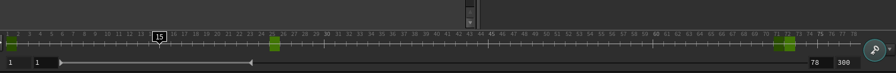
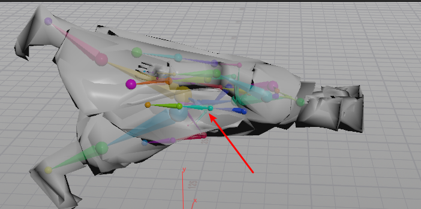

## Houdini 导入fbx先关设置   

#### 过程 

+ 原来 fbx文件全称呼是  Filmbox全场景数据导入格式  
    

+ 开始是文集过滤方式  
     
  + 分别是相机 
  + 集合体 
  + 动画数据
  + 骨骼和蒙皮信息
  + 灯光
  + 材质和纹理  
+ 动画采样过程   
   
  + resample 说明的是当前采样过程    
  + 这里默认是 tcb 曲线采样，没一帧采样一次是因为不止该tcb 曲线表达    
  + 第二个选择是，对于所有高次采样降级 线性采样   
  + override FBX  Frame Rate  覆盖fbx帧速率， 如果fbx中帧速率文集本身就不对，这里导入可以左修正  
  +  opverride scene Frame Range  这个经过测试 是导入动画的帧范围， 但是之前场景中 如果有 很长的动画数据会在，只是修改了时间 范围     
      

+ 角色选项     
 
   
   
    
  + Hide Joninst   隐藏参与蒙皮骨骼点，  不隐藏就是下图那样， 可以看到一个 骨骼球点，需要说明的是，这里只是隐藏， 观看节点链接中 其实还是 可以看到利用空节点 代替骨骼点的  
  +  如果是从3dsmax中 导入的动画数据需要勾选 ，不然动画效果 会有 90度旋转 ，如果勾选，所有动画数据都将要从新采样     
     

  + Create Sibling Bones for VisUalization   创建可视化骨骼， 如果不勾选看不到骨骼显示， 在节点中所有的骨骼和  joninst 都是由于 空节点代替     
     
       
+ 材质选项   
首先fbx要带材质这里才管用    

